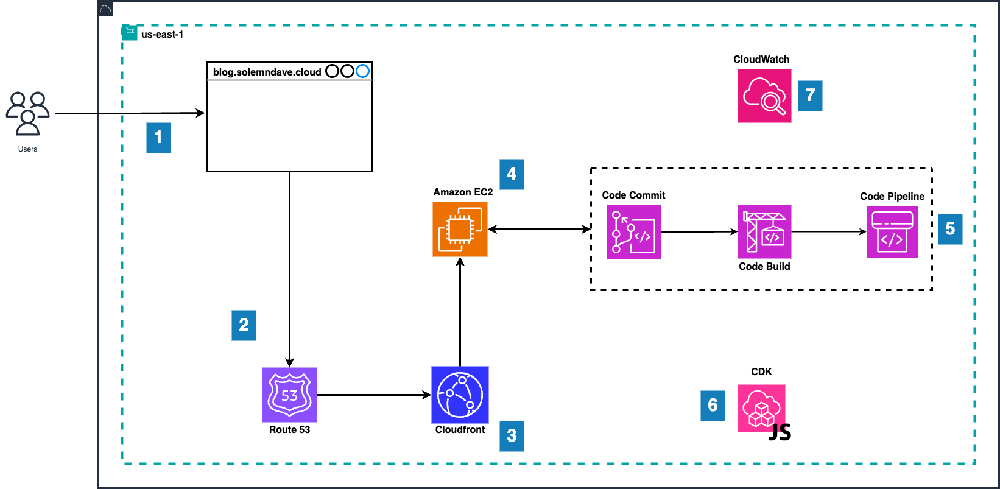

## Project Blog is a website created using AWS that is dedicated to documenting the courses and books that I engage in.

# Architecture

## Table of Contents

- [Overview](#overview)
- [Services Used](#services-used)
- [Step by step](#step-by-step)
  - [Step 1 - Design and Frontend Development with React](#step-1---design-and-frontend-development-with-react)
  - [Step 2 - Setup and Configure EC2 Instance for Hosting](#step-2---setup-and-configure-ec2-instance-for-hosting)
  - [Step 3 - DNS Management and SSL Configuration with Route 53 and ACM](#step-3---dns-management-and-ssl-configuration-with-route-53-and-acm)
  - [Step 4 - Implement CloudFront for Content Delivery](#step-4---implement-cloudfront-for-content-delivery)
- [Upcoming Steps](#upcoming-steps)

  - [Step 5 - Streamlined CI/CD with AWS CodeBuild and CodePipeline for Direct Deployment to EC2](#step-5---streamlined-cicd-with-aws-codebuild-and-codepipeline-for-direct-deployment-to-ec2)

## Overview

### This project encapsulates the full lifecycle of a modern web application, from design and development to deployment and continuous integration. It's a comprehensive showcase of utilizing a variety of technologies and services, primarily focusing on React for frontend development, AWS services for hosting and deployment, and CI/CD practices for streamlined development workflows.

## Services Used

###

- React (for frontend development)
- Sass (for styling)
- React Router (for client-side routing)
- Context API/Redux (for state management)
- Amazon EC2 (Elastic Compute Cloud)
- Elastic IP (for EC2 instance)
- Nginx (web server)
- SSH (Secure Shell)
- AWS Route 53 (for DNS management)
- AWS Certificate Manager (ACM)
- Amazon CloudFront (for content delivery)
- AWS CodeBuild
- AWS CodePipeline
- GitHub (for source control)
- AWS Parameter Store

# Step by step

## Step 1 - Design and Frontend Development with React

### UI/UX Design

- The layout and user experience of the Project Blog were carefully designed to ensure ease of navigation and accessibility. Attention was paid to creating an engaging and user-friendly interface that smoothly guides users through the content.

### React Components

- The website's user interface was constructed using React components. This included developing several key pages:
  - Home Page: Serving as the landing page, it provides a welcoming introduction and quick access to other sections.
  - Book Page: Dedicated to showcasing the books engaged in, with detailed information and insights.
  - Course Page: Focused on the courses undertaken, this page offers an overview and key takeaways from each course.
  - Project Page: A special page providing in-depth information about the Project Blog itself.

### React Routing

- Client-side navigation was implemented using React Router. This allowed for seamless transitions between different pages and sections of the website without the need for page reloads, offering a smoother user experience.

### Styling with Sass

- For styling, Sass (Syntactically Awesome Style Sheets) was employed. This powerful CSS extension language enabled more complex, maintainable, and readable stylesheets. It enhanced the overall aesthetic appeal and ensured consistency across the website.

### State Management

- The application's state was managed using React's built-in Context API. This approach was chosen for its simplicity and efficiency in handling state within the app, especially given the scale and complexity of the state management needs.

### Outcome

The result of this step was a fully functional, aesthetically pleasing, and user-friendly frontend for the Project Blog website.

## Step 2 - Setup and Configure EC2 Instance for Hosting

### Launch EC2 Instance

- An appropriate EC2 instance type was selected based on the required computing resources and expected traffic.
  The instance was launched and configured, setting the foundation for the server environment.
  #### Operating System (OS)
      - Linux
  #### Amazon Machine Image (AMI)
      - Amazon Linux 2023 AMI
  #### Architecture
      - 64-bit (x86)

### Allocate and Associate Elastic IP

- An Elastic IP was allocated to provide the EC2 instance with a static public IP address.
  This static IP ensures a consistent access point for the website, crucial for reliable DNS configuration and accessibility.

### Server Setup with Nginx

- Nginx, a high-performance web server, was installed on the EC2 instance.
  It was configured to serve the React application's build as static files, optimizing the delivery and performance of the website.

### Security Group Configuration

- The security group for the EC2 instance was carefully configured to enhance security:
  HTTP (port 80) and HTTPS (port 443) traffic were allowed, enabling web access to the site.
  SSH (port 22) access was restricted to the current IP address only, adding an extra layer of security against unauthorized access.

### SSH Key Pair Setup

- An SSH key pair was generated using AWS, providing a secure method for logging into the EC2 instance.
  The private key was downloaded and stored securely, ensuring safe and controlled access to the server.

### Outcome

By the end of this step, a fully configured and secure EC2 instance was ready, serving as the robust backbone for hosting the Project Blog. The implementation of Nginx ensures that the website is accessible through my Elastic IP.

## Step 3 - DNS Management and SSL Configuration with Route 53 and ACM

### DNS Setup with Route 53

- A custom domain name was set up and configured using AWS Route 53, Amazon's scalable and highly available DNS web service.
- Initially, an A record was created in Route 53, which pointed to the Elastic IP associated with the EC2 instance. This setup linked the domain name directly to the server hosting the website.
- Later, to leverage the benefits of Amazon CloudFront, the A record was updated to Alias mode. This change redirected the domain name to the CloudFront distribution domain, ensuring efficient content delivery and scalability.

### SSL Configuration with AWS Certificate Manager (ACM)

- To secure the website and protect user data, an SSL certificate was necessary.
- A free SSL certificate (blog.solemndave.cloud) was requested through AWS Certificate Manager (ACM).
  The SSL certificate was then configured with the domain to enable HTTPS connections. This ensures that all data transmitted between the web server and browsers remains encrypted and secure from interception or tampering.

### Outcome

At the completion of this step, the Project Blog was not only accessible via a custom domain but also secured with SSL encryption. The integration of Route 53 for DNS management and ACM for SSL configuration played a role in enhancing my website's security and reliability, providing a safe and consistent user experience.

## Step 4 - Implement CloudFront for Content Delivery

### Creating CloudFront Distribution

- A new CloudFront distribution was created, with the EC2 instance (utilizing its public DNS name) specified as the origin server. This setup allowed the distribution to fetch and cache content from the EC2-hosted website.
  The protocol policy was initially set to 'Match Viewer', allowing CloudFront to serve content over the same protocol (HTTP or HTTPS) as the viewer's request. However, due to connectivity issues encountered, it was later adjusted to 'HTTP only', simplifying the setup and resolving these issues.

### SSL Configuration with CloudFront

- The CloudFront distribution was configured to use the SSL certificate obtained from AWS Certificate Manager (ACM). This ensured that the content delivery was secured with HTTPS.
  SSL termination occurred at CloudFront edge locations, which offloaded the encryption and decryption processes from the EC2 instance, improving efficiency.

### Setting CNAMEs in CloudFront

-Custom domain names, such as blog.solemndave.cloud, were included in the CloudFront distribution settings. This allowed users to access the website through these friendly URLs, enhancing brand visibility and user experience.

### Cache Behavior Configuration

- The cache behavior for the CloudFront distribution was carefully configured to align with the specific needs of the application. This involved setting parameters like TTL (Time To Live), query string forwarding, and cache invalidation policies to optimize content delivery and performance.

### Updating DNS Records in Route 53

- The DNS records in Route 53 were updated to point to the CloudFront distribution. By doing so, traffic intended for the website was now routed through CloudFront, allowing for efficient content distribution and the benefit of HTTPS encryption.

### Outcome

Implementing Amazon CloudFront as the CDN for Project Blog significantly improved the site’s loading times and overall performance. The use of SSL encryption through CloudFront ensured secure content delivery, while the DNS updates made the site easily accessible through a custom domain. These enhancements contributed to a superior user experience and bolstered the website's reliability and scalability.

# Upcoming Steps

## Step 5 - Streamlined CI/CD with AWS CodeBuild and CodePipeline for Direct Deployment to EC2

### Source Control Integration with GitHub

- The React project was hosted in a GitHub repository, forming the basis for version control and source code management.
  This integration was essential for triggering the CI/CD pipeline upon code commits.

### Setting Up AWS CodeBuild

- AWS CodeBuild was configured to connect with the GitHub repository.
  A custom build environment was chosen and a build project was created.
  The build process was defined to focus on building the React application effectively.

### Configuring the buildspec.yml File

- A buildspec.yml file was created and added to the repository.
  This file specified the build commands and included steps to securely retrieve necessary credentials, such as SSH keys, from the AWS Parameter Store.

### Integrating with AWS CodePipeline

- AWS CodePipeline was set up to manage the entire CI/CD workflow.
  It was connected to both CodeBuild and the GitHub repository to ensure seamless integration.
  The pipeline was configured to automatically trigger builds in CodeBuild upon new code commits to the repository.

### Automating Deployment to the EC2 Instance

- A deployment stage was added to the CodePipeline configuration.
  This stage used AWS CodeBuild to execute deployment commands specified in the buildspec.yml file, automating the deployment of build artifacts directly to the EC2 instance.

### Utilizing AWS Parameter Store for Secure Credential Management

- Sensitive information, such as SSH keys, was securely stored in the AWS Parameter Store.
  These credentials were then retrieved securely during the build and deployment processes, maintaining the integrity and security of the deployment pipeline.

### Security and Access Control

- Proper IAM roles were set up for both CodeBuild and CodePipeline, ensuring that each component of the CI/CD pipeline had the necessary permissions to function correctly.
  The security of SSH access to the EC2 instance was maintained throughout the process.

### Outcome

By implementing a CI/CD pipeline with AWS CodeBuild and CodePipeline, the deployment process for Project Blog is optimized. The pipeline ensures that the latest version of the application is automatically built, tested, and deployed to the EC2 instance, reflecting changes in real-time and minimizing manual intervention.
